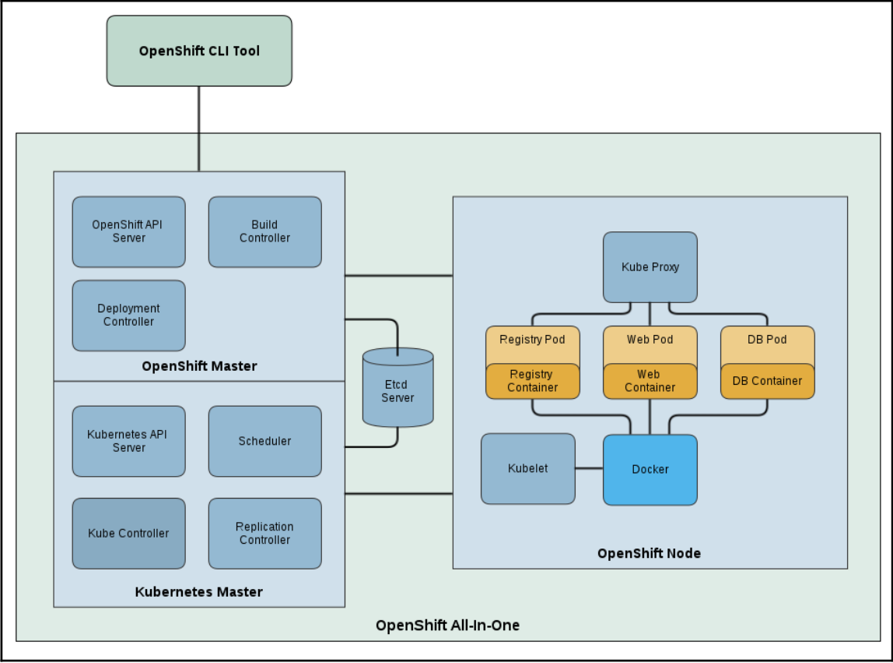

# Docker Use Cases

## Testing with Docker
We will create images with one container with Python 2.7 and another with Python 3.7. We'll then use sample Python test code to run against each container.

1. As we are going to use example code from Flask's GitHub repository, let's clone
it:
```bash
$ mkdir testing
$ cd testing
$ git clone https://github.com/pallets/flask
```
2. Create a `Dockerfile_2.7` file, as follows, and then build an image from it:
```bash
$ cat Dockerfile_2.7
FROM python:2.7
RUN pip install flask pytest
ADD flask/ /flask
WORKDIR /flask/examples/tutorial
RUN pip install -e .
CMD ["/usr/local/bin/pytest"]
```
3. To build the `python2.7test` image, run the following command:
```bash
$ docker image build -t python2.7test -f Dockerfile_2.7 .
```
4. Similarly, create a Dockerfile with `python:3.7` as the base image and build the `python3.7test` image:
```bash
$ cat Dockerfile_3.7
FROM python:3.7
RUN pip install flask pytest
ADD flask/ /flask
WORKDIR /flask/examples/tutorial
RUN pip install -e .
CMD ["/usr/local/bin/pytest"]
```
5. To build the `python3.7test` image, run the following command:
```bash
$ docker image build -t python3.7test -f Dockerfile_3.7 .
```
6. See the images created
```bash
 $ docker image ls
REPOSITORY      TAG       IMAGE ID       CREATED             SIZE
python2.7test   latest    811d09c1332b   25 minutes ago      923MB
python3.7test   latest    f80e17574f77   About an hour ago   931MB
python          3.7       eb092e58e924   5 days ago          903MB
python          2.7       68e7be49c28c   22 months ago       902MB
```
7. Start containers using those images
```bash
 $ docker container run python3.7test
============================= test session starts ==============================
platform linux -- Python 3.7.12, pytest-7.0.1, pluggy-1.0.0
rootdir: /flask/examples/tutorial, configfile: setup.cfg, testpaths: tests
collected 24 items

tests/test_auth.py ........                                              [ 33%]
tests/test_blog.py ............                                          [ 83%]
tests/test_db.py ..                                                      [ 91%]
tests/test_factory.py ..                                                 [100%]

============================== 24 passed in 1.70s ==============================
 $ 
 $ 
 $ docker container run python2.7test
============================= test session starts ==============================
platform linux2 -- Python 2.7.18, pytest-4.6.11, py-1.11.0, pluggy-0.13.1
rootdir: /flask/examples/tutorial, inifile: setup.cfg, testpaths: tests
collected 24 items

tests/test_auth.py EEEEEEEE                                              [ 33%]
tests/test_blog.py EEEEEEEEEEEE                                          [ 83%]
tests/test_db.py EE                                                      [ 91%]
tests/test_factory.py FE                                                 [100%]

==================================== ERRORS ====================================
```
As you can see from the two Dockerfiles, before running the CMD, which runs the pytest binary, we add the Flask source code to the image, change our working directory to the tutorial example directory, /flask/examples/tutorial, and install the app. So, as soon as the container starts, it will run the pytest binary on our tests.

## Setting up PaaS with OpenShift origin
Platform-as-a-Service (PaaS) is a type of cloud service where the consumer controls software deployments and configuration settings for applications (mostly web), and the provider provides servers, networks, and other services to manage those deployments. The provider can be external (public provider) or internal (IT department in an organization). There are many PaaS providers, such as Amazon (https:/​/​aws.​amazon.​com), Heroku
(https:/​/​www.​heroku.​com), OpenShift (https:/​/​www.​openshift.​com), and so on. In the recent past, containers seem to have become the natural choice for applications to get deployed to.

OpenShift (https:/​/​github.​com/openshift/​origin) is a PaaS that leverages technologies such as Docker and Kubernetes (https:/​/​kubernetes.​io) among others, providing a complete ecosystem to service your cloud-enabled apps.

<p align="center">
  
</p>

For the Kubernetes section, you will notice that to deploy an app, we need to define Pods, Services, and Replication-Controllers. OpenShift tries to
abstract all that information and let you define one configuration file that takes care of all the internal wiring. Further, OpenShift provides other features such as automated deployment through source code push, centralized administration and management of applications, authentication, team and project isolation, and resource tracking and limiting, all of which are required for enterprise deployment.

- In First recipe we will set up all-in-one OpenShift Origin on a VM and start a pod. (Refer Book or online tutorial)
- In the next recipe, we will see how to build and deploy an app through source code using the Source-to-image (S2I) build feature. (Refer book or online tutorial)
