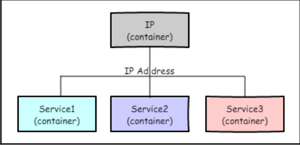
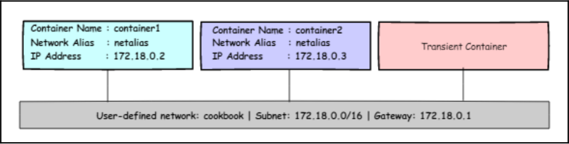

# Network and Data Management for Containers

When the Docker daemon starts, it creates a virtual Ethernet bridge with the `namedocker0`. Perhaps we can glean more insight into `docker0` using the `ip addr` command on the system that runs the Docker daemon:
```bash
 $ ip addr show docker0
5: docker0: <NO-CARRIER,BROADCAST,MULTICAST,UP> mtu 1500 qdisc noqueue state DOWN group default 
    link/ether 02:42:2f:a7:3c:4c brd ff:ff:ff:ff:ff:ff
    inet 172.17.0.1/16 brd 172.17.255.255 scope global docker0
       valid_lft forever preferred_lft forever
```
As we can see, docker0 has the IP address of 172.17.0.1/16. Docker randomly chooses an address and subnet from a private range. Using this bridged interface, containers can communicate with each other and with the host system.

By default, every time Docker starts a container, it creates a pair of virtual Ethernet interfaces and then performs the following with the pair:
- Ties one end of the `veth` pair to the `docker0` bridge interface in the Docker
host—let's call this end the **host end**.
- Ties the other end of the `veth` pair to the newly created container as its `eth0`
interface—let's call this end of the veth pair the **container end**.

Let's start a container and examine its network interface IP addresses:
```bash
 $ docker container run --rm -it alpine
/ # ip addr
1: lo: <LOOPBACK,UP,LOWER_UP> mtu 65536 qdisc noqueue state UNKNOWN qlen 1000
    link/loopback 00:00:00:00:00:00 brd 00:00:00:00:00:00
    inet 127.0.0.1/8 scope host lo
       valid_lft forever preferred_lft forever
7: eth0@if8: <BROADCAST,MULTICAST,UP,LOWER_UP,M-DOWN> mtu 1500 qdisc noqueue state UP 
    link/ether 02:42:ac:11:00:02 brd ff:ff:ff:ff:ff:ff
    inet 172.17.0.2/16 brd 172.17.255.255 scope global eth0
       valid_lft forever preferred_lft forever
/ # 
```

The container end of the `veth` pair is named `eth0@if18`, where `18` is the interface index of the host end of the `veth` pair. We can use this index to identify the host end of the `veth` pair in the Docker host. The `eth0` of the container is assigned the IP address `172.17.0.2`, which belongs to the `docker0` subnet—that is, `172.17.0.1/16`.

Now, let's take a peek at the interface at the seventeenth index:
```bash
$ ip addr 
...
8: veth535c553@if7: <BROADCAST,MULTICAST,UP,LOWER_UP> mtu 1500 qdisc noqueue master docker0 state UP group default 
    link/ether 36:71:bb:48:8b:6d brd ff:ff:ff:ff:ff:ff link-netnsid 0
    inet6 fe80::3471:bbff:fe48:8b6d/64 scope link 
       valid_lft forever preferred_lft forever
```
We are using the `--network=host` option of the `docker container run` command to connect to the Docker host's network stack.
```bash
 $ docker container run --rm -it --network=host alpine brctl show
bridge name     		bridge id               STP enabled     interfaces
br-932ebf24810f         8000.02428efd246c       no
br-e7e415952dd4         8000.02428386ae8b       no
docker0         		8000.02422fa73c4c       no
```
All the host ends of the `veth` pairs are bound to the default Docker bridge `docker0`. Apart from setting up the `docker0` bridge, Docker also creates iptables NAT rules, so that all containers can talk to the external world by default, but the external world cannot talk to the containers. Let's look at the NAT rules on the Docker host

```bash
 $ sudo iptables -t nat -L -n
Chain PREROUTING (policy ACCEPT)
target     prot opt source               destination         
DOCKER     all  --  0.0.0.0/0            0.0.0.0/0            ADDRTYPE match dst-type LOCAL

Chain INPUT (policy ACCEPT)
target     prot opt source               destination         

Chain OUTPUT (policy ACCEPT)
target     prot opt source               destination         
DOCKER     all  --  0.0.0.0/0           !127.0.0.0/8          ADDRTYPE match dst-type LOCAL

Chain POSTROUTING (policy ACCEPT)
target     prot opt source               destination         
MASQUERADE  all  --  172.17.0.0/16        0.0.0.0/0           
MASQUERADE  all  --  172.18.0.0/16        0.0.0.0/0           
MASQUERADE  all  --  172.19.0.0/16        0.0.0.0/0           

Chain DOCKER (2 references)
target     prot opt source               destination         
RETURN     all  --  0.0.0.0/0            0.0.0.0/0           
RETURN     all  --  0.0.0.0/0            0.0.0.0/0           
RETURN     all  --  0.0.0.0/0            0.0.0.0/0
```

In the preceding output, a `POSTROUTING` rule is configured for the `172.17.0.0/16` subnet. The sole purpose of this rule is to change the source IP address of the data packets that originated from the `172.17.0.0/16` subnet to the host IP address. Apparently, the `172.17.0.0/16` subnet is assigned to our `docker0` bridge. Essentially, this `POSTROUTING` rule enables the Docker containers to connect to the external world, as you can see in the following traceroute output:

```bash
 $ docker run --rm alpine traceroute -m 3 -n 8.8.8.8
traceroute to 8.8.8.8 (8.8.8.8), 3 hops max, 46 byte packets
 1  172.17.0.1  0.007 ms  0.005 ms  0.007 ms
 2  192.168.1.1  2.132 ms  2.058 ms  1.961 ms
 3  115.98.212.1  5.672 ms  3.843 ms  3.666 ms
```

## Accessing containers from outside

- `--publish`, `-p` 		: 	Publish a container's port to the host
- `--publish-all`, `-P` 	: 	Publish all exposed ports to random ports
Both these options allow the external world to connect to the services running inside the containers through the ports of the Docker host.

```bash
$ docker container run -d -p 80:80 apache2
a101ac9009f2237a2e4356e9caed6d0cf1666b5b86768f559a629d39034b4132
$ docker container port a101ac9009f2
80/tcp -> 0.0.0.0:80
```
Evidently, port 80 of the Docker container is mapped to port 80 of the Docker host. The IP address of 0.0.0.0 implies any IP address in the Docker host.
Now you can connect to the apache service running inside your container from any network using the Docker host IP address, as long as the Docker host has IP network connectivity from that network.

When a container is launched with `-p <host port>:<container port>`, the Docker Engine configures the iptables destination NAT rule. This destination NAT rule is responsible for forwarding all the packets it receives on the Docker host port to the container's port:

```bash
 $ sudo iptables -t nat -L -n
Chain PREROUTING (policy ACCEPT)
target     prot opt source               destination         
DOCKER     all  --  0.0.0.0/0            0.0.0.0/0            ADDRTYPE match dst-type LOCAL

Chain INPUT (policy ACCEPT)
target     prot opt source               destination         

Chain OUTPUT (policy ACCEPT)
target     prot opt source               destination         
DOCKER     all  --  0.0.0.0/0           !127.0.0.0/8          ADDRTYPE match dst-type LOCAL

Chain POSTROUTING (policy ACCEPT)
target     prot opt source               destination         
MASQUERADE  all  --  172.17.0.0/16        0.0.0.0/0           
MASQUERADE  all  --  172.18.0.0/16        0.0.0.0/0           
MASQUERADE  all  --  172.19.0.0/16        0.0.0.0/0           
MASQUERADE  tcp  --  172.17.0.2           172.17.0.2           tcp dpt:80

Chain DOCKER (2 references)
target     prot opt source               destination         
RETURN     all  --  0.0.0.0/0            0.0.0.0/0           
RETURN     all  --  0.0.0.0/0            0.0.0.0/0           
RETURN     all  --  0.0.0.0/0            0.0.0.0/0           
DNAT       tcp  --  0.0.0.0/0            0.0.0.0/0            tcp dpt:8080 to:172.17.0.2:80
```

Noticeably, the Docker Engine has inserted a destination NAT rule with the following configurations:
- **Source address** `0.0.0.0/0`: A wild card address that means that this rule is applicable to packets received from any source
- **Destination address** `0.0.0.0/0`: A wild card address that means that this rule is applicable to the packets received on any network interface of the Docker host
- **Destination port** `dpt:8080`: One of the key attributes in this rule, which enables the iptables to selectively apply the rule to the packets that are sent only to port 8080 of the Docker host
- **Forwarding address** `172.17.0.2:80`: The container's IP address and port to which the iptables forward the packets when the aforementioned criteria are met.

The `-P` (`--publish-all`) option of the docker container run command reads out the container port from the image metadata and maps it to a random higher-order port (`32768` to `61000`) in the Docker host. The `EXPOSE` instruction of Dockerfile adds the port information to the image metadata.

## Attaching containers to a host network
Docker by default attached our container to the default bridge network `docker0` and then leveraged the `DNAT` rule of iptables to allow `TCP` connection from the external world. However, there are many use cases wherein the container needs full access to the host network namespace.

1. First, let's launch an alpine container without prescribing any network option and invoke the `ip address` command, as shown in the following screenshot:
```bash
 $ docker container run -it --rm alpine sh
/ # ip address
1: lo: <LOOPBACK,UP,LOWER_UP> mtu 65536 qdisc noqueue state UNKNOWN qlen 1000
    link/loopback 00:00:00:00:00:00 brd 00:00:00:00:00:00
    inet 127.0.0.1/8 scope host lo
       valid_lft forever preferred_lft forever
11: eth0@if12: <BROADCAST,MULTICAST,UP,LOWER_UP,M-DOWN> mtu 1500 qdisc noqueue state UP 
    link/ether 02:42:ac:11:00:02 brd ff:ff:ff:ff:ff:ff
    inet 172.17.0.2/16 brd 172.17.255.255 scope global eth0
       valid_lft forever preferred_lft forever
```
2. Now, let's continue to launch an alpine container by attaching it to the Docker host's network stack by using `--net=host` as an argument and executing the `ip address` command.
```bash
 $ docker container run -it --rm --net=host alpine sh
/ # ip address
1: lo: <LOOPBACK,UP,LOWER_UP> mtu 65536 qdisc noqueue state UNKNOWN qlen 1000
    link/loopback 00:00:00:00:00:00 brd 00:00:00:00:00:00
    inet 127.0.0.1/8 scope host lo
       valid_lft forever preferred_lft forever
    inet6 ::1/128 scope host 
       valid_lft forever preferred_lft forever
2: enp2s0: <NO-CARRIER,BROADCAST,MULTICAST,UP> mtu 1500 qdisc fq_codel state DOWN qlen 1000
    link/ether 10:7d:1a:3a:7b:a8 brd ff:ff:ff:ff:ff:ff
3: wlp1s0: <BROADCAST,MULTICAST,UP,LOWER_UP> mtu 1500 qdisc noqueue state UP qlen 1000
    link/ether e8:9e:b4:20:44:09 brd ff:ff:ff:ff:ff:ff
    inet 192.168.1.10/24 brd 192.168.1.255 scope global dynamic noprefixroute wlp1s0
       valid_lft 75972sec preferred_lft 75972sec
    inet6 fe80::e440:eaa0:e31e:8598/64 scope link noprefixroute 
       valid_lft forever preferred_lft forever
4: br-932ebf24810f: <NO-CARRIER,BROADCAST,MULTICAST,UP> mtu 1500 qdisc noqueue state DOWN 
    link/ether 02:42:60:12:4c:e3 brd ff:ff:ff:ff:ff:ff
    inet 172.19.0.1/16 brd 172.19.255.255 scope global br-932ebf24810f
       valid_lft forever preferred_lft forever
5: br-e7e415952dd4: <NO-CARRIER,BROADCAST,MULTICAST,UP> mtu 1500 qdisc noqueue state DOWN 
    link/ether 02:42:23:b6:a4:30 brd ff:ff:ff:ff:ff:ff
    inet 172.18.0.1/16 brd 172.18.255.255 scope global br-e7e415952dd4
       valid_lft forever preferred_lft forever
6: docker0: <BROADCAST,MULTICAST,UP,LOWER_UP> mtu 1500 qdisc noqueue state UP 
    link/ether 02:42:ce:de:0c:b8 brd ff:ff:ff:ff:ff:ff
    inet 172.17.0.1/16 brd 172.17.255.255 scope global docker0
       valid_lft forever preferred_lft forever
    inet6 fe80::42:ceff:fede:cb8/64 scope link 
       valid_lft forever preferred_lft forever
12: veth5047741@if11: <BROADCAST,MULTICAST,UP,LOWER_UP,M-DOWN> mtu 1500 qdisc noqueue master docker0 state UP 
    link/ether ba:ba:36:74:04:02 brd ff:ff:ff:ff:ff:ff
    inet6 fe80::b8ba:36ff:fe74:402/64 scope link 
       valid_lft forever preferred_lft forever
```
Evidently, in step 1, Docker created a network namespace for the container and assigned an IP address for the container, whereas, in step 2, Docker attached the container to the host network stack, hence the container has full access to the host's network stack.

## Launching containers with no network
Docker inherently supports three types of network (`bridge`, `hosts`, and `none`), as is evident in the following `docker network ls` command output:

```bash
 $ docker network ls
NETWORK ID     NAME      DRIVER    SCOPE
b3d355af8434   bridge    bridge    local
cc30fcb154e5   host      host      local
a719b9b7a55c   none      null      local
```

Launch a container with no network by using the `--net none` argument in the `docker container run` command, as shown in the following screenshot:
```bash
 $ docker container run --rm --net=none alpine ip address
1: lo: <LOOPBACK,UP,LOWER_UP> mtu 65536 qdisc noqueue state UNKNOWN qlen 1000
    link/loopback 00:00:00:00:00:00 brd 00:00:00:00:00:00
    inet 127.0.0.1/8 scope host lo
       valid_lft forever preferred_lft forever
```
Docker only creates a loopback interface for that container. Since there is no Ethernet interface defined for this container, the container is isolated from the network.

## Sharing IP addresses with other containers
When we launch a container, the Docker Engine assigns an IP address to that container. Of course, we can use the host network mode to attach the container to the Docker host's IP address, or use the none network mode to launch a container without any IP address assigned to it. However, you might come across scenarios wherein multiple services have to share the same IP address. In such situations, you can run multiple services inside a container; however, such a practice is deemed as anticontainer-pattern.
The better alternative is to run each service inside separate containers, but share the IP address, as shown in the following topology:

<p align="center">
  
</p>

The Docker Engine assigns an IP address for the IP container and then the IP address is inherited by the Service1, Service2, and Service3 containers.

1. Firstly, launch a container in the background.
```bash
 $ docker container run -itd --name=ipcontainer alpine
30ee32d70a8caa18c01881ba440e7281e100baeaf0d50f4e19d75910d9bce731
```
2. Look at the IP address of the `ipcontainer`.
```bash
 $ docker container exec ipcontainer ip addr
1: lo: <LOOPBACK,UP,LOWER_UP> mtu 65536 qdisc noqueue state UNKNOWN qlen 1000
    link/loopback 00:00:00:00:00:00 brd 00:00:00:00:00:00
    inet 127.0.0.1/8 scope host lo
       valid_lft forever preferred_lft forever
13: eth0@if14: <BROADCAST,MULTICAST,UP,LOWER_UP,M-DOWN> mtu 1500 qdisc noqueue state UP 
    link/ether 02:42:ac:11:00:02 brd ff:ff:ff:ff:ff:ff
    inet 172.17.0.2/16 brd 172.17.255.255 scope global eth0
       valid_lft forever preferred_lft forever
```
3. Launch a container by attaching its network to the ipcontainer and display the IP addresses attached to this container:
```bash
 $ docker container run --rm --net container:ipcontainer alpine ip addr
1: lo: <LOOPBACK,UP,LOWER_UP> mtu 65536 qdisc noqueue state UNKNOWN qlen 1000
    link/loopback 00:00:00:00:00:00 brd 00:00:00:00:00:00
    inet 127.0.0.1/8 scope host lo
       valid_lft forever preferred_lft forever
13: eth0@if14: <BROADCAST,MULTICAST,UP,LOWER_UP,M-DOWN> mtu 1500 qdisc noqueue state UP 
    link/ether 02:42:ac:11:00:02 brd ff:ff:ff:ff:ff:ff
    inet 172.17.0.2/16 brd 172.17.255.255 scope global eth0
       valid_lft forever preferred_lft forever
```
As is evident in step 2 and step 3, `eth0` of ipcontainer in step 2 and the transient container in step 3 have the same interface index of 4 and IP address of `172.17.0.2`.

We created one container and then created subsequent containers to use the network of the first container. In this case, the Docker Engine would create a network namespace for the first container and then assign the same namespace for the other containers too.

When containers share the network namespace, the original container that created the namespace must be in a running state until the other containers are running. If the original container is stopped before the other containers, dependent container will have only a loopback address.

```bash
 $ docker container run -dit --net container:ipcontainer --name service1 alpine
8915e946cce363ece9b27ce48a5651136bbb18725520f263b022063e726dc582
 $
 $ docker ps -a
CONTAINER ID   IMAGE     COMMAND     CREATED         STATUS          PORTS     NAMES
8915e946cce3   alpine    "/bin/sh"   5 seconds ago   Up 4 seconds              service1
30ee32d70a8c   alpine    "/bin/sh"   2 hours ago     Up 12 minutes             ipcontainer
$
$ docker container stop ipcontainer 
ipcontainer
 $ docker container exec service1 ip addr
1: lo: <LOOPBACK,UP,LOWER_UP> mtu 65536 qdisc noqueue state UNKNOWN qlen 1000
    link/loopback 00:00:00:00:00:00 brd 00:00:00:00:00:00
    inet 127.0.0.1/8 scope host lo
       valid_lft forever preferred_lft forever
```
Containers in a Kubernetes (http://kubernetes.io/) pod use this trick to share the IP address between the containers in a pod.

## Creating a user-defined bridge network
The containers that are connected through the default bridge can communicate with each other using the IP address, but not the container's name. In microservice architecture, multiple containers are orchestrated to provide a meaningful higher-level service, and it is imperative that these containers communicate with each other effectively.

The user-defined bridge network is functionally very much akin to the default bridge. however, it provides the following additional features:
- Service discovery through an embedded DNS server, which is an excellent fit for multicontainer orchestration and communication.
- DNS-based load balancing, another cool feature that complements multicontainer orchestration and communication. Notably, this feature allows us to seamlessly and transparently scale containers.
- Optionally, we can configure our own subnet to the bridge.
- Optionally, we can manually assign an IP address to the containers from the bridge's subnet.

1. creating a new user-defined bridge network using the docker network create command.
```bash
 $ docker network create mynetwork
9d6414dfa513aa87295b8076130432acef79613384a4e498e048268a4d609a9c
 $ 
 $ docker network inspect mynetwork
[
    {
        "Name": "mynetwork",
        "Id": "9d6414dfa513aa87295b8076130432acef79613384a4e498e048268a4d609a9c",
        "Created": "2022-02-12T22:49:33.588125306+05:30",
        "Scope": "local",
        "Driver": "bridge",
        "EnableIPv6": false,
        "IPAM": {
            "Driver": "default",
            "Options": {},
            "Config": [
                {
                    "Subnet": "172.18.0.0/16",
                    "Gateway": "172.18.0.1"
                }
            ]
        },
        "Internal": false,
        "Attachable": false,
        "Ingress": false,
        "ConfigFrom": {
            "Network": ""
        },
        "ConfigOnly": false,
        "Containers": {},
        "Options": {},
        "Labels": {}
    }
]
```
Here, the `172.18.0.0/16` subnet is assigned to the user-defined bridge network cookbook and the `172.18.0.1` IP address is assigned to the gateway.
Look at the interface details of the Docker host:
```bash
 $ ip addr
1: lo: <LOOPBACK,UP,LOWER_UP> mtu 65536 qdisc noqueue state UNKNOWN group default qlen 1000
    link/loopback 00:00:00:00:00:00 brd 00:00:00:00:00:00
    inet 127.0.0.1/8 scope host lo
       valid_lft forever preferred_lft forever
    inet6 ::1/128 scope host 
       valid_lft forever preferred_lft forever
2: enp2s0: <NO-CARRIER,BROADCAST,MULTICAST,UP> mtu 1500 qdisc fq_codel state DOWN group default qlen 1000
    link/ether 10:7d:1a:3a:7b:a8 brd ff:ff:ff:ff:ff:ff
3: wlp1s0: <BROADCAST,MULTICAST,UP,LOWER_UP> mtu 1500 qdisc noqueue state UP group default qlen 1000
    link/ether e8:9e:b4:20:44:09 brd ff:ff:ff:ff:ff:ff
    inet 192.168.1.10/24 brd 192.168.1.255 scope global dynamic noprefixroute wlp1s0
       valid_lft 81664sec preferred_lft 81664sec
    inet6 fe80::e440:eaa0:e31e:8598/64 scope link noprefixroute 
       valid_lft forever preferred_lft forever
6: docker0: <NO-CARRIER,BROADCAST,MULTICAST,UP> mtu 1500 qdisc noqueue state DOWN group default 
    link/ether 02:42:ce:de:0c:b8 brd ff:ff:ff:ff:ff:ff
    inet 172.17.0.1/16 brd 172.17.255.255 scope global docker0
       valid_lft forever preferred_lft forever
    inet6 fe80::42:ceff:fede:cb8/64 scope link 
       valid_lft forever preferred_lft forever
21: br-9d6414dfa513: <NO-CARRIER,BROADCAST,MULTICAST,UP> mtu 1500 qdisc noqueue state DOWN group default 
    link/ether 02:42:28:c2:4b:8a brd ff:ff:ff:ff:ff:ff
    inet 172.18.0.1/16 brd 172.18.255.255 scope global br-9d6414dfa513
       valid_lft forever preferred_lft forever
```
A new Linux bridge interface, `br-9d6414dfa513`, is created, and is assigned the address `172.18.0.1/16`. The bridge name is derived by concatenating the `br-` string with the first twelve digits of the network ID.

Finally, let's look at the iptables to understand the NATing behavior of the user-defined bridge:
```bash
 $ sudo iptables -t nat -L -n
Chain PREROUTING (policy ACCEPT)
target     prot opt source               destination         
DOCKER     all  --  0.0.0.0/0            0.0.0.0/0            ADDRTYPE match dst-type LOCAL

Chain INPUT (policy ACCEPT)
target     prot opt source               destination         

Chain OUTPUT (policy ACCEPT)
target     prot opt source               destination         
DOCKER     all  --  0.0.0.0/0           !127.0.0.0/8          ADDRTYPE match dst-type LOCAL

Chain POSTROUTING (policy ACCEPT)
target     prot opt source               destination         
MASQUERADE  all  --  172.18.0.0/16        0.0.0.0/0           
MASQUERADE  all  --  172.17.0.0/16        0.0.0.0/0           

Chain DOCKER (2 references)
target     prot opt source               destination         
RETURN     all  --  0.0.0.0/0            0.0.0.0/0           
RETURN     all  --  0.0.0.0/0            0.0.0.0/0
```
a **NAT** **POSTROUTING** rule has been added for the `172.18.0.0/16` subnet, like the default bridge.
When we create a user-defined bridge, Docker creates a Linux bridge interface and creates the necessary **NAT** rules in the iptables.

The docker network create command provides over a dozen options to customize your network according to your business requirements. In the following example, we are creating a user-defined network on a **10.1.0.0/16** subnet:
```bash
$ docker network create 10dot1net --subnet 10.1.0.0/16
```

## Discovering and load balancing containers
We will build a container topology

<p align="center">
  
</p>

In this topology, we will launch `container1` and `container2` like a service and use a transient container to demonstrate the following capabilities of the user-defined bridge network:
- Service discovery through an embedded DNS server
- DNS-based load balancing

1. Let's start off by spinning two containers, `container1` and `container2`, by connecting them to the user-defined bridge network `mynetwork` using the `docker container run` command.

```bash
 $ docker container run -dit --name container1 --network-alias netalias --net mynetwork alpine
505eb71ca24c67fcb4ab6b558d4e3c240e8b1cfa8de6b3d8b6c40779e41dcdb8
 $ docker container run -dit --name container2 --network-alias netalias --net mynetwork alpine
edffef4ddeadb9374e7528a2a7b55f4fe79edf4126d6873b3b0688fc856c5d88
```
Here, the `--network-alias` option helps us to group multiple containers with a single alias name and load balance using the embedded DNS. The embedded DNS provides round-robin load balancing.

2. Look at the IP address of both `container1` and `container2` using the `docker container inspect` command:

```bash
 $ docker container inspect --format '{{.NetworkSettings.Networks.mynetwork.IPAddress}}' container1
172.18.0.2
 $ docker container inspect --format '{{.NetworkSettings.Networks.mynetwork.IPAddress}}' container2
172.18.0.3
```

3. Now, let's use transient containers to understand the service discovery capability of user-defined networks, as demonstrated in the following screenshot:
```bash
 $ docker container run --rm --net mynetwork alpine ping -c1 container1
PING container1 (172.18.0.2): 56 data bytes
64 bytes from 172.18.0.2: seq=0 ttl=64 time=0.234 ms

--- container1 ping statistics ---
1 packets transmitted, 1 packets received, 0% packet loss
round-trip min/avg/max = 0.234/0.234/0.234 ms
 $ 
 $ docker container run --rm --net mynetwork alpine ping -c1 container2
PING container2 (172.18.0.3): 56 data bytes
64 bytes from 172.18.0.3: seq=0 ttl=64 time=0.152 ms

--- container2 ping statistics ---
1 packets transmitted, 1 packets received, 0% packet loss
round-trip min/avg/max = 0.152/0.152/0.152 ms
```

Now the containers can communicate with each other by using the containers' names. This service discovery capability simplifies the multicontainer orchestration a great deal.

4. Having delved into the service discovery capability, let's gain more understanding of the `DNS` load balancing capability of the user-defined network by pinging the network alias `netalias`, as shown in the following screenshot:
```bash
 $ docker container run --rm --net mynetwork alpine ping -c1 netalias
PING netalias (172.18.0.3): 56 data bytes
64 bytes from 172.18.0.3: seq=0 ttl=64 time=0.096 ms

--- netalias ping statistics ---
1 packets transmitted, 1 packets received, 0% packet loss
round-trip min/avg/max = 0.096/0.096/0.096 ms
 $ 
 $ docker container run --rm --net mynetwork alpine ping -c1 netalias
PING netalias (172.18.0.2): 56 data bytes
64 bytes from 172.18.0.2: seq=0 ttl=64 time=0.111 ms

--- netalias ping statistics ---
1 packets transmitted, 1 packets received, 0% packet loss
round-trip min/avg/max = 0.111/0.111/0.111 ms
 $ docker container run --rm --net mynetwork alpine ping -c1 netalias
PING netalias (172.18.0.3): 56 data bytes
64 bytes from 172.18.0.3: seq=0 ttl=64 time=0.165 ms

--- netalias ping statistics ---
1 packets transmitted, 1 packets received, 0% packet loss
round-trip min/avg/max = 0.165/0.165/0.165 ms
```
As we can discern from the preceding screenshot, the first ping on `netalias` got a response from the IP address `172.18.0.3`, which is `container2`, and the second ping on `netalias` got a response from `172.18.0.2`, which is `container1`. In essence, the embedded DNS load balancer resolved the `netalias` using a round-robin algorithm.

When a container is connected to a user-defined network, the Docker Engine adds the container's name and its network alias (if present) to the user-defined network's DNS record. Then Docker shares these details to the other containers connected to the same user-defined network through the embedded DNS hosted at `127.0.0.11`.

## Persisting data using volumes
The container's read–write layer is temporary, and is destroyed when the container is removed. Docker volumes are a special directory in the Docker host, and are created and managed by Docker itself. We can mount these volumes to our container and have the application store its data to the volume. The Docker volumes are either named or anonymous. Functionally, the anonymous volumes are the same as named volumes; however, the anonymous volume
name is randomly generated. Docker also supports the volume plugin to address advanced storage needs.

Perform the following the steps:
1. Let's begin by creating a named volume using the docker volume create command, as shown in the following code:
```
$ docker volume create datavol datavol
```
2. List the volume using the docker volume ls command, as shown in the following code:
```
$ docker volume create ls
DRIVER VOLUME NAME
local
datavol
```
3. Launch an interactive container using the docker container run command and -v option to mount the `datavol` volume to the container, as shown in the
following code:
```
$ docker container run -it --rm -v datavol:/data alpine / #
```
4. Now, let's create a new file at the `/data` directory of the container and write some text to it:
```
/ # echo "This is a named volume demo" > /data/demo.txt / #
```
5. Exit from the preceding container and remove the container using the docker `container rm` command.
6. Now, launch a new container by mounting the `datavol` volume again and print the content of the `demo.txt`, as shown in the following code. Here, we are intentionally choosing an ubuntu image just to stress that the Docker volume functions the same way irrespective of the Docker image from which the container is created:
```bash
$ docker container run --rm \ -v datavol:/data ubuntu cat /data/demo.txt
```

The default docker volume create command creates a directory for the volume under the `/var/lib/docker/volumes/` directory of the Docker host. For instance, in this recipe, a `datavol` directory is created under `/var/lib/docker/volumes/`. Furthermore, Docker internally creates one more directory called `_data` for each volume under the directory it created for that volume. We can confirm the directory path by running the `docker volume inspect` command.
```bash
 $ docker volume inspect datavol
[
    {
        "CreatedAt": "2022-02-13T15:17:00+05:30",
        "Driver": "local",
        "Labels": {},
        "Mountpoint": "/var/lib/docker/volumes/datavol/_data",
        "Name": "datavol",
        "Options": {},
        "Scope": "local"
    }
]
```
When we mount the volume to a container, Docker internally bind mounts the `_data` directory of the volume to the container. Since the file operation is externalized from the container, the life cycle of the volume is separated from the container.

## Sharing data between the host and the container
In this recipe, we will use bind mounting to mount a Docker host directory to a container and then share data between the Docker host and container using that mount point.

1. Let's begin by creating a new directory called `data_share` directory, as shown in the following code:
```bash
$ mkdir data_share
 $ ls
data_share  README.md
 $ pwd
/home/himanshu/HP/dev/Learn-Docker/network_and_data_management
```
Launch a container by mounting the `data_share` directory and then print the content of the `demo.txt`:
```
 $ docker container run --rm -dit -v /home/himanshu/HP/dev/Learn-Docker/network_and_data_management/data_share:/data ubuntu 
b32f1a8ea67f3daa047454f016a9bd5c06df8bcb8ed8abe6dddcfb271728c8a2
root@b32f1a8ea67f:/# cd data/
root@b32f1a8ea67f:/data# cat demo.txt 
Data sharing demo
```
Any changes made to the file in docker container or docker host will be reflected in same file.
When a container is launched with the `-v <host path>:<container path>` option, the Docker Engine bind mounts the host path into the container filesystem on the specified container path. The bind mount is a Linux capability that is used to take an existing directory structure and map it to a different location.

In this recipe, we mounted a directory to the container. Similarly, we can also mount individual files to the container, as shown in the following code:
```bash
$ docker container run --rm -v $(PWD)/data_share/demo.txt:/demo.txt ubuntu cat /demo.txt
data sharing demo
```
By default, when we mount a directory or a file into a container, it gets mounted in read–write mode, so that the container can alter the content of the mounted directory or file. We can prevent the containers from modifying the content of the mounted directory or file using the `ro` flag, as demonstrated in the following code:
```bash
$ touch file
$ docker container run --rm -v ${PWD}/file:/file:rw ubuntu sh -c "echo rw mode >> /file"
$ cat file
rw mode
$ docker container run --rm -v ${PWD}/file:/file:ro ubuntu sh -c "echo ro >> /file"
sh: 1: cannot create /file: Read-only file system
```
Apparently, the write operation failed when we mounted the file as read-only.
